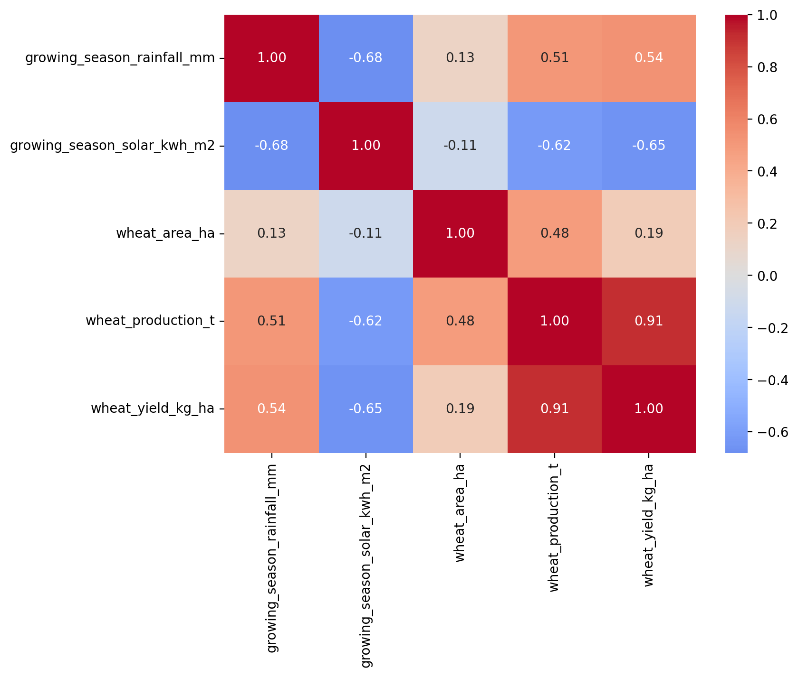

# Syria WheatWatch
### Drought Impact on Cereal Production — An Open Data Analysis (1991–2025)

---

## Introduction: Why This Project Matters

The 2030 Agenda for Sustainable Development, adopted by all United Nations Member States in 2015, lays out 17 interlinked goals that together form a shared blueprint for peace, prosperity, and planetary health. Our project sits at the intersection of several of these goals:

- **SDG 2 — Zero Hunger**: End hunger, achieve food security, improve nutrition, and promote sustainable agriculture.
- **SDG 13 — Climate Action**: Take urgent action to combat climate change and its impacts.
- **SDG 6 — Clean Water and Sanitation**: Ensure availability and sustainable management of water.
- **SDG 15 — Life on Land**: Protect, restore, and promote sustainable use of terrestrial ecosystems.

Climate change is no longer an abstract projection. It is unfolding now, and its effects are felt most severely by populations already living under stress — populations for whom the failure of a single harvest can mean the difference between subsistence and famine. Syria is one such case.

In the 2024–2025 growing season, Syria experienced its worst drought in nearly four decades. Rainfall fell more than **50% below the long-term average**, and the consequence was catastrophic: wheat production collapsed to **900,000 tonnes**, the lowest level in over half a century. The resulting **3 million tonne wheat deficit** pushed millions of people into acute food insecurity, compounding the devastation of more than a decade of conflict.

Understanding the relationship between climate and crop failure — measuring it, quantifying it, and preparing for it — is not an academic exercise. It is a humanitarian imperative. That is what this project sets out to do.

---

## What Is Syria WheatWatch?

**Syria WheatWatch** is an open, reproducible data analysis and early-warning tool that examines how rainfall and solar irradiance variability between 1991 and 2025 has affected wheat production in Syria. Using Python to process publicly available climate and agricultural datasets, we quantify the relationship between climate stress and crop failure, identify rainfall thresholds below which harvests become critically compromised, and build a predictive interface that allows non-specialists to explore what-if scenarios.

The project delivers:

1. A **full analytical notebook** documenting every step from raw data to final findings.
2. A **public REST API and web interface** powered by a trained linear regression model, deployed for interactive use.
3. A **Power BI dashboard** providing an interactive visual layer over the cleaned dataset, with regional breakdowns and drought severity indicators.
4. A **data-driven early-warning framework** designed to help agricultural planners anticipate drought-driven shortfalls before they occur.

---

## Team Participation

This project was developed by **Team 4** as part of the **FTL Syria AI4Climate Python Hackathon**.

| Name | Email | Field | Gender | WhatsApp | Assigned Role |
|---|---|---|---|---|---|
| **Abdulrahman Abdulkader** | arakhallak@gmail.com | Computer and Automation Engineering | Man | +963 980 172 126 | Deployment & API |
| **Ahmad Deeb** | ahmaddeebdev@gmail.com | Electronics and Communications Engineering | Man | +963 960 000 000 | Data Engineering Lead |
| **aous azzam** | aousazzam2003@gmail.com | Computer and Automation Engineering | Man | 0931690303 | Analysis Lead |
| **Haya Sukkar** | haya.sukkar3@gmail.com | Electronics and Communications Engineering | Man | +963 931 891 434 | Visualization & Power BI |
| **Nimra Afzaal** | nimraafzaal1998@gmail.com | Electrical and Power Engineering | Woman | 03094713313 | Domain Research & Coordination |
| **sular Albalkhi** | sularalbalkhi@gmail.com | Electronics and Communications Engineering | Woman | +963 936 943 700 | Data Engineering Support |

### Role descriptions

**Deployment & API — Abdulrahman Abdulkader**
Owns the FastAPI service, model packaging, Render deployment, and the web interface. Responsible for ensuring the trained model is accessible through both a browser form and a JSON API endpoint.

**Data Engineering Lead — Ahmad Deeb**
Owns the NASA POWER pipeline, HDX rainfall integration, FAOSTAT processing, and the caching architecture that makes the whole analysis reproducible from raw sources.

**Analysis Lead — aous azzam**
Owns the correlation analysis, regression modelling, KPI design, and statistical interpretation. Responsible for the empirical findings that drive the project's conclusions.

**Visualization & Power BI — Haya Sukkar**
Owns the matplotlib/seaborn figure generation, notebook documentation, and the interactive Power BI dashboard. Responsible for translating analytical results into clear, communicable visuals across both static and interactive media.

**Domain Research & Coordination — Nimra Afzaal**
Owns problem framing, SDG alignment, dataset curation, and day-to-day project coordination across all workstreams.

**Data Engineering Support — sular Albalkhi**
Supports the data pipeline with data cleaning, quality assurance, and cross-validation of processing logic across the three datasets.

---

## Project Goals

### Primary research question

> **How has rainfall variability between 1991 and 2025 affected wheat production in Syria, and what precipitation thresholds predict crop failure?**

### Secondary goals

- Quantify the statistical relationship between growing-season rainfall and wheat yield.
- Establish whether solar irradiance can serve as an independent proxy for clear-sky drought conditions.
- Distinguish between two production channels: **planted area** (land-use decisions) versus **yield** (per-hectare output), and identify which one is climate-driven.
- Build a lightweight predictive model that converts rainfall and solar inputs into yield estimates.
- Provide a public-facing tool (web + API + Power BI dashboard) that lets analysts, planners, and researchers test scenarios interactively.

---

## Datasets

We combine three independent, credible, publicly available datasets, each covering the 1991–2025 study window.

### 1. NASA POWER — Solar Irradiance
- **Source**: [power.larc.nasa.gov](https://power.larc.nasa.gov/)
- **Variable**: `ALLSKY_SFC_SW_DWN` (surface solar irradiance, converted from MJ/m²/day to kWh/m²/day)
- **Resolution**: daily, five Syrian regions (Hassakeh, Aleppo, Idleb, Raqqa, Homs)
- **Retrieved via**: the NASA POWER REST API, with caching for reproducibility
- **Coverage**: 1991-01-01 to 2025-12-31, 12,784 daily records per region

### 2. HDX / Climate Hazards Center — Subnational Rainfall
- **Source**: [data.humdata.org/dataset/syr-rainfall-subnational](https://data.humdata.org/dataset/syr-rainfall-subnational)
- **Variables**: `rfh` (10-day rainfall in mm), `rfh_avg` (climatological mean), `rfq` (anomaly vs normal)
- **Resolution**: dekadal (10-day), national-level
- **Coverage**: 1981 to 2026

### 3. FAOSTAT — Crop Production
- **Source**: [fao.org/faostat](https://www.fao.org/faostat/en/#data/QCL)
- **Variables**: Production (tonnes), Area harvested (hectares), Yield (kg/hectare) for Wheat and Barley
- **Coverage**: 1961 to 2024 (we use 1991 onward)

---

## What We Did — Method and Analysis

### Phase 1: Data Acquisition and Cleaning

We built a reproducible pipeline that pulls each dataset from its primary source, handles missing values and fill codes correctly, and caches every step so results can be regenerated months or years later.

**Solar data.** NASA POWER returns solar irradiance in **MJ/m²/day** under the Agroclimatology community. We detected this by auditing the raw value distribution — 73% of values exceeded 12 kWh/m²/day, which is physically impossible at Syria's latitude. Dividing by 3.6 (the MJ-to-kWh conversion factor) produced a physically plausible range of ~3–9 kWh/m²/day. This correction is documented in the notebook and is essential for correct interpretation.

**Rainfall data.** HDX provides dekadal (10-day) totals. We sum these within the growing season (November through May) to produce an annual growing-season total per year. The year-shift logic assigns November–December of year *Y−1* to growing season *Y*, since that is how wheat in Syria is actually cultivated.

**Production data.** FAOSTAT is loaded in long format (one row per year × crop × element) and pivoted into a wide format with `wheat_production_t`, `wheat_area_ha`, and `wheat_yield_kg_ha` as columns.

**Merge.** All three datasets are inner-joined on `year`, producing a final analytical panel of **34 rows (1991–2024)** with six core variables.

### Phase 2: Exploratory Data Analysis

We produced a systematic audit of every variable:

- **Time series plots** for all five signals (rainfall, solar, area, production, yield), with the 2011–2018 conflict period shaded for context.
- **Distribution analysis** by decade, revealing a clear regime shift in the early 2010s.
- **Correlation matrix** quantifying pairwise relationships across all five variables.
- **Stationarity check** via Augmented Dickey-Fuller test on the area series (result: non-stationary, driven by a 2011 structural break, not a stochastic unit root).

### Phase 3: Correlation Analysis

The correlation matrix produced the project's core empirical finding:



| Pair | r | Significance | Interpretation |
|---|---|---|---|
| Rainfall ↔ Solar | **−0.68** | *** | Clear-sky years are dry years |
| Rainfall ↔ Yield | **+0.54** | ** | Drought hurts per-hectare output |
| Solar ↔ Yield | **−0.65** | *** | Solar is a valid drought proxy |
| Production ↔ Yield | **+0.91** | *** | Yield drives production almost entirely |
| Rainfall ↔ Area | **+0.13** | n.s. | Land-use decisions are not climate-driven |
| Solar ↔ Area | **−0.11** | n.s. | Same — decoupled from climate |

**Key insight:** climate variability propagates through the **yield channel**, not the **area channel**. Planted area in Syria is driven by conflict, policy, and economic factors — not by whether it rained that year.

### Phase 4: Regression Modelling

We fitted a simple linear regression to predict wheat yield from rainfall and solar irradiance:

```
yield_kg_ha ≈ 16,212 + 0.029 × rainfall_mm − 954.5 × solar_kwh_m2
```

**Model performance:**
- R² ≈ 0.42 (in-sample), ≈ 0.35 (cross-validated)
- MAE ≈ 402 kg/ha
- RMSE ≈ 547 kg/ha (19.4% of mean yield)

The **positive rainfall coefficient** and **negative solar coefficient** are both consistent with the drought-stress interpretation: when rainfall drops, yield drops; when clear-sky solar rises (a marker of dry conditions), yield drops.

We also fitted the same model on `wheat_area_ha` as a diagnostic — R² = 0.017, confirming that planted area is essentially unpredictable from climate alone.

### Phase 5: Visualization

We generated a suite of publication-quality figures saved to `outputs/`:

- **`timeseries_all.png`** — five-panel time series of every signal
- **`distributions_by_era.png`** — distribution shift across 1991–2000, 2001–2010, 2011–2024
- **`corr_heatmap.png`** — full correlation matrix
- **Additional figures** as documented in the notebook

### Phase 6: Predictive Interface (FastAPI + Web UI)

To make the analysis usable beyond the notebook, we packaged the yield model into a lightweight **FastAPI** service with both a **web interface** and a **JSON API**:

- **Web interface** — a simple HTML form where the user enters growing-season rainfall and solar values, and receives a predicted yield in kg/ha.
- **API endpoint** — `POST /api/predict?rainfall=250&solar=4.2` returns JSON.
- **Interactive docs** — automatically generated at `/docs` via FastAPI's Swagger integration.

The model is loaded once at application startup, not on every request, for performance.

[**Live deployment**](https://syria-wheat-api.onrender.com/)


### Phase 7: Power BI Interactive Dashboard

To complement the static figures and the API, we built an interactive **Power BI dashboard** over the cleaned analytical dataset (`yearly_clean.csv`). The dashboard is designed for non-technical stakeholders — agricultural planners, humanitarian coordinators, and policy analysts — who need to explore the data on their own terms without writing code.

**Dashboard content:**

- **Headline KPI cards** — the three most important indicators at a glance:
  - Growing-season rainfall anomaly (% vs 1991–2020 baseline)
  - Wheat production (million tonnes, current year vs baseline)
  - Rainfall–wheat elasticity (how much yield changes per 1% rainfall deficit)
- **Dual-axis time series** — rainfall bars (color-coded by drought severity) with wheat production line overlaid, covering 1991–2024.
- **Regional heatmap** — standardized rainfall anomaly by region and year, highlighting drought years across Hassakeh, Aleppo, Idleb, Raqqa, and Homs.
- **Scatter plot** — growing-season rainfall vs wheat yield, with a regression line, R² annotation, and key crisis years labeled.
- **Year slicer** — interactive filter allowing the user to zoom into any period of interest.

**Planned screenshots:** _[Dashboard images to be added]_

**Data source:** The dashboard connects to `data_clean/yearly_clean.csv`, ensuring it stays in sync with the Python pipeline. When new data becomes available, refreshing the Power BI report is a one-click operation.

**Relationship to the FastAPI service:** The Power BI dashboard is exploratory and historical; the FastAPI service is predictive and forward-looking. Together they cover the two primary use cases — understanding what happened, and anticipating what may happen next.

**Repository structure:**

```
syria-wheatwatch/
├── data_loader.py        # NASA POWER, HDX, FAOSTAT loaders
├── config.py             # Paths and constants
├── preprocess.ipynb      # Data cleaning and merging
├── simple_model.ipynb    # Regression modelling
├── visualize.ipynb       # Figures
├── model.py              # Model training script
├── main.py               # FastAPI app
├── templates/index.html  # Web UI
├── powerbi/
│   └── SyriaWheatWatch.pbix   # Power BI dashboard file
├── requirements.txt
├── data_raw/             # Raw cached datasets
├── data_clean/           # Processed datasets
└── outputs/              # Generated figures and model artifacts
```

---

## Main Findings

1. **Rainfall and solar irradiance are strongly and inversely correlated (r = −0.68).** Clear-sky years in Syria are dry years. This validates using solar as an independent drought proxy.

2. **Both climate variables correlate significantly with wheat yield (r = +0.54 and −0.65), but not with planted area (both n.s.).** Climate affects *how much each hectare produces*, not *how much land gets planted*.

3. **A linear regression on rainfall and solar explains ~35% of cross-validated yield variance** — a meaningful, actionable signal for early warning.

4. **Planted area declined in three discrete steps** (3.35 → 3.02 → 2.59 Mha), with no post-conflict recovery. This reflects structural, political, and economic disruption — not weather.

5. **Production tracks yield almost perfectly (r = 0.91).** Because planted area is stable-ish year-to-year, year-to-year production swings are dominated by yield.

---

## Proposed Solution: An Early-Warning Framework

Based on these findings, we propose a minimal but practical early-warning framework:

1. **Growing-season monitoring.** At the end of each November–May season, feed rainfall and solar observations into the deployed FastAPI model.
2. **Threshold alerts.** Flag years where predicted yield falls more than 25% below the 1991–2020 baseline.
3. **Planner dashboard.** Surface the outputs as a simple dashboard with three indicators: rainfall anomaly, predicted yield, and production-at-risk. The Power BI dashboard provides the historical context; the API provides forward-looking estimates.
4. **Iterative improvement.** As more FAOSTAT years become available, retrain the model and expand features (irrigation coverage, conflict intensity, seed-access indicators).

The infrastructure is already in place — notebook, API, and dashboard. What remains is integration with an operational data stream and a human decision-making loop.

---

## Limitations

- **Small sample size (n = 34)** limits statistical power. The regression coefficients carry wide confidence intervals.
- **Coarse spatial resolution.** We aggregate five climate points to a national level. Subnational yield variation is not captured in the regression.
- **Non-climate confounders.** Conflict, policy, and economic factors that heavily influenced production during 2011–2018 are not represented in the model.
- **Correlation is not causation.** The rainfall–yield relationship is observational. We infer drought stress from co-variation, not from controlled experiments.
- **Solar as drought proxy.** Solar irradiance is a valid proxy for clear-sky conditions, but it is not a physical drought indicator. A dedicated soil-moisture or evapotranspiration dataset would strengthen the analysis.
- **Dashboard refresh is manual.** The Power BI report must be refreshed when new data is added to the CSV. Automating this would require a scheduled flow or a direct database connection.

---

## Next Steps

- Integrate **subnational production data** (where available) to test whether the climate signal is stronger in specific regions (e.g., rainfed northeast vs. irrigated central).
- Add **lagged climate features** to test whether previous-year rainfall influences current-year planting decisions.
- Expand the model with **conflict and policy indicators** as control variables.
- Package the analysis as a reusable Python library for other drought-affected regions.
- Automate the data refresh pipeline to update predictions when new FAOSTAT and HDX data become available.
- **Publish the Power BI dashboard** to the Power BI Service and embed the live view in a web page, complementing the FastAPI interface.

---

## Getting Started

### Requirements

```
python>=3.10
fastapi
uvicorn[standard]
scikit-learn
joblib
jinja2
numpy
pandas
matplotlib
seaborn
scipy
statsmodels
requests
```

### Run locally

```bash
# Install dependencies
pip install -r requirements.txt

# Generate the dataset
jupyter notebook preprocess.ipynb

# Train the model
jupyter notebook simple_model.ipynb

# Launch the API + web interface
uvicorn main:app --reload
```

Then visit **http://localhost:8000** for the web interface or **http://localhost:8000/docs** for the interactive API documentation.

### Open the Power BI dashboard

Open `powerbi/SyriaWheatWatch.pbix` in **Power BI Desktop** (free download from Microsoft). The report connects to `data_clean/yearly_clean.csv`. To refresh after new data is added, click **Home → Refresh**.

### Screen shot


---

## Project Deliverables

| # | Deliverable | Location |
|---|---|---|
| 1 | Python notebook | `preprocess.ipynb`, `simple_model.ipynb`, `visualize.ipynb` |
| 2 | Datasets (raw + cleaned) | `data_raw/`, `data_clean/` |
| 3 | Final presentation (≤7 slides) | `presentation.pdf` |
| 4 | Project summary | This README |
| 5 | Public API + Web interface | [link](https://syria-wheat-api.onrender.com/) |
| 6 | Power BI dashboard | `powerbi/SyriaWheatWatch.pbix` + screenshots |

---

## Acknowledgements

This project was developed for the **FTL Syria AI4Climate Python Hackathon**, an initiative of the **Future Tech Leaders Programme**. We thank the programme organizers for the challenge framing and the emphasis on using Python and open climate data for practical impact.

We also gratefully acknowledge the following public data providers whose open infrastructure makes work like ours possible:

- **NASA POWER** — for continuous, high-quality solar and meteorological reanalysis data
- **Humanitarian Data Exchange (HDX)** — for subnational rainfall indicators
- **FAOSTAT** — for decades of consistent agricultural statistics
- **World Bank Climate Change Knowledge Portal** — for contextual climate reference data

---

## License

This project is released under the **MIT License**. Datasets retain their original licenses and attribution requirements from NASA, HDX, and FAO.

---

*"The failure of a harvest is not an act of God alone. It is the intersection of weather, policy, and preparation. Our work is one small contribution to making the third of those three more robust."*